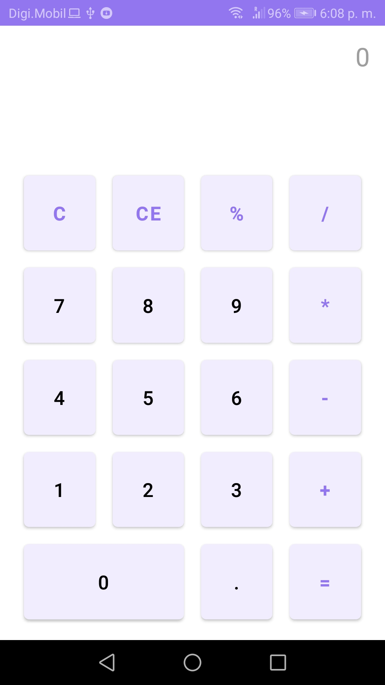
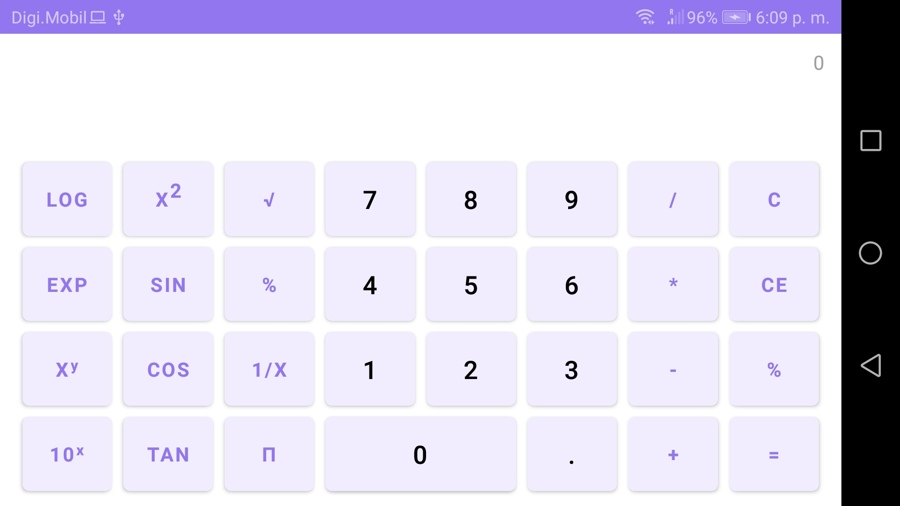

## Description

This is an application developed in Android Studio with the Java programming language that allows the user to perform arithmetic calculations. In the vertical position, it has the functions of a normal calculator and in the horizontal position, functions of a scientific calculator.

## Author

**Alejandro Martinez**

* [LinkedIn](https://www.linkedin.com/in/diego-alejandro-martinez-espinosa-571086134)

## Screenshots 

## Installation

This project requires to be installed on android mobile devices. 

| Sdk      | Version      |
| :------- | :----------- |
| `min`    | **26**       |
| `target` | **31**       |

## Feedback

If you have any feedback, please reach out to us at dreamstime@outlook.es
